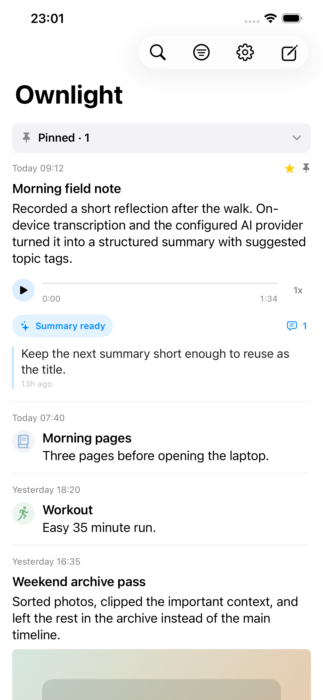
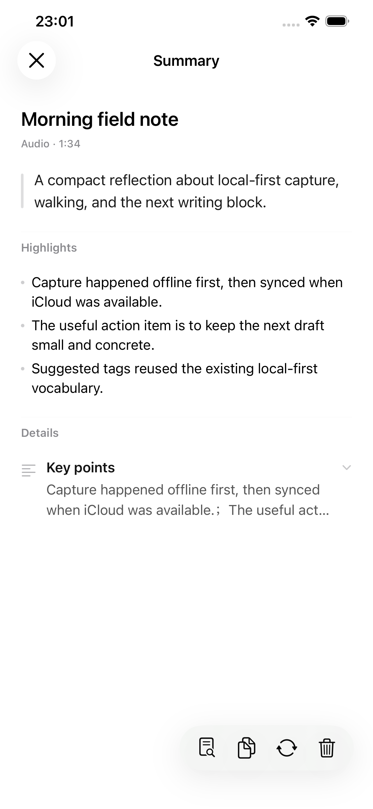
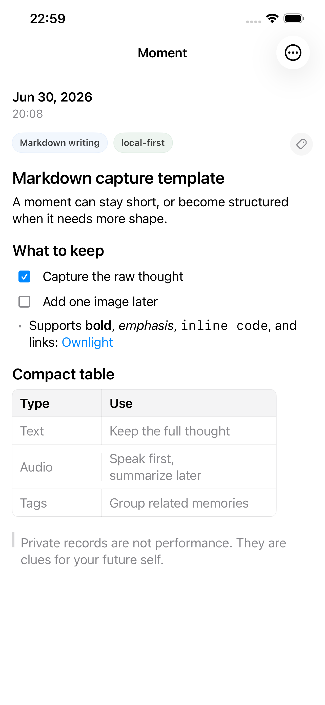
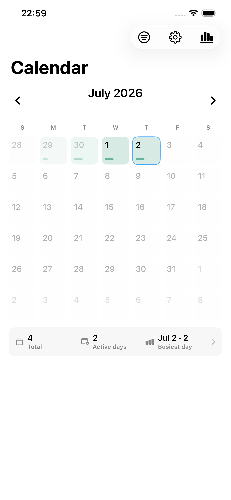
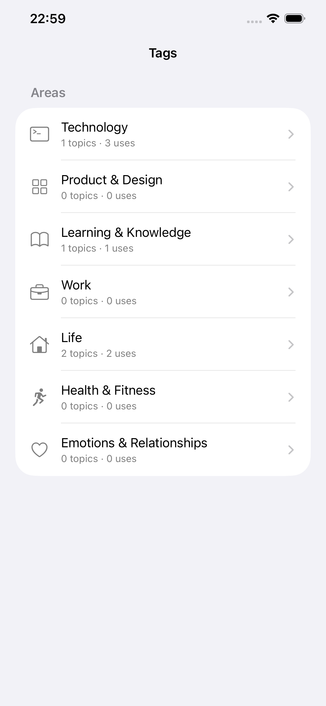
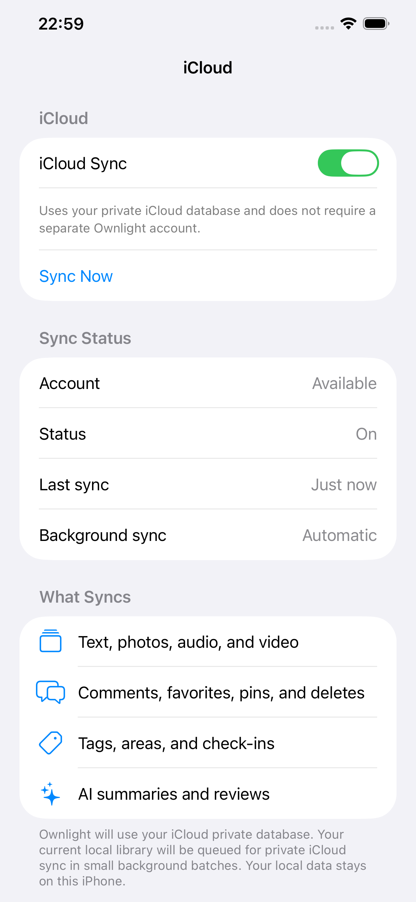

# Ownlight

Ownlight is a private, local-first personal timeline for iPhone.

[Download Ownlight on the App Store](https://apps.apple.com/app/id6778719728) or build it from source under the MIT License.

The iOS app is the product: new moments are saved into this iPhone's local SQLite archive first, and the timeline remains usable without iCloud, a server, or network connection. iCloud / CloudKit is the current optional cross-device sync direction.

Ownlight is meant for personal archives, not social sharing. It supports text, photos, audio, video, document attachments, comments, favorites, smart tags, check-ins, calendar review, Share Sheet import, local archive export, empty-library local archive import, offline retry, opt-in iCloud sync, and iPhone-direct AI summaries/reviews through user-configured providers.

## Screenshots

<p>
  
  
  
</p>

<p>
  
  
  
</p>

The tracked screenshots use deterministic demo data and contain no private user content. To regenerate them for UI work:

```bash
npm run ios:simulator:demo
```

The demo fixture is opt-in and only runs when the app is launched with `--private-moments-demo-data`. It writes deterministic local posts, tags, comments, AI-summary metadata, media placeholders, and check-ins into the simulator database. The normal app path never seeds demo data.

- [PRD](docs/PRD.md)
- [Technical Design](docs/TECH-DESIGN.md)
- [Integration Guide](docs/INTEGRATION-GUIDE.md)
- [Operator Runbook](docs/OPERATOR-RUNBOOK.md)
- [Networking](docs/NETWORKING.md)
- [Workflow](docs/WORKFLOW.md)
- [Handoff](docs/HANDOFF.md)
- [Design Principles](docs/DESIGN-PRINCIPLES.md)
- [Release Checklist](docs/RELEASE-CHECKLIST.md)
- [Open Source Readiness](docs/OPEN-SOURCE-READINESS.md)

## Development

Requirements:

- macOS with Xcode 16 or later.
- iOS 17 or later.
- Node.js 22 or later.
- [XcodeGen](https://github.com/yonaskolb/XcodeGen).

Install dependencies:

```bash
npm install
```

Low-impact iOS verification, which avoids launching Simulator and limits Xcode build parallelism:

```bash
npm run verify:ios:low-impact
```

Install and launch on the paired iPhone:

```bash
npm run ios:device
```

Optional setup flags remain available for legacy service work:

```bash
npm run setup:local -- --with-ai
npm run setup:local -- --with-ios
```

`--with-ai` prepares the optional transcription helper environment. `--with-ios` regenerates the Xcode project with `xcodegen`.

## iOS App

Run Simulator only when visual UI review or screenshots are required:

```bash
npm run ios:simulator
```

Run the simulator with reusable demo data for screenshots and UI review:

```bash
npm run ios:simulator:demo
```

After Simulator work, shut down old simulator state to reduce Mac memory and WindowServer pressure:

```bash
npm run ios:simulator:cleanup
```

The normal app can be used as a standalone iPhone archive. If you opt into iCloud, enable `Settings > Data Storage > iCloud > iCloud Sync` after confirming the account/container state.

For machine-specific device, signing, bundle identifier, App Group, and remote URL settings:

```bash
cp .env.local.example .env.local
```

`npm run ios:simulator` and `npm run ios:device` read `.env.local` and generate an ignored `ios/Config/Local.xcconfig` for local iOS overrides.

The iOS app stores local posts, comments, tags, generated AI artifact metadata, compressed images, audio/video/document media, posters, Share Extension imports, drafts, and compatibility sync state under the app's Application Support or App Group directories. Audio/video AI starts with a private local transcript on the iPhone, then uses the text-analysis provider configured in Settings > AI & Analysis. Provider API keys stay in the iPhone Keychain and are not included in iCloud sync, export packages, or legacy server storage. Settings is organized around `This iPhone`, `iCloud`, `Storage & Export`, `AI & Analysis`, tags, and app preferences.

`Storage & Export` can export a local archive zip and can import that zip back into an empty local iPhone library. Import is a restore drill, not a merge or overwrite tool: it refuses to run when local posts, media, comments, custom tags, check-ins, AI summaries, or outbox operations already exist, and it does not restore API keys or private transcript text.

After iOS code changes on the integration branch, rebuild and reinstall to the real device with `npm run ios:device`. For non-visual work, prefer `npm run verify:ios:low-impact` or focused tests first; use Simulator only for screenshot-backed UI review.

## Legacy Server And Admin Workspaces

The repository still contains `server/` and `admin/` for historical compatibility, API contract reference, archive tooling, and maintenance experiments. They are not required for ordinary iPhone-first use or current iCloud sync work.

Manual legacy setup:

```bash
cp server/.env.example server/.env
npm run server:prisma:generate
npm run server:prisma:deploy
npm run admin:build
npm run server:build
npm run server:dev
```

Before first legacy server start, set `PRIVATE_MOMENTS_INITIAL_PASSWORD` in `server/.env`. This password is only used to create the first local user when the database has no users.

The legacy server defaults to:

```text
http://127.0.0.1:3210
```

After `npm run admin:build`, the legacy Admin UI is served at:

```text
http://127.0.0.1:3210/admin/
```

The Admin `Archive` tab can configure a restic backup repository, create a project-managed `.private-moments-restic-key`, run manual or scheduled daily backups, list/check snapshots, restore a snapshot into a staged directory, and prepare a verified restore for promotion. Treat this as a maintenance path, not the current product default; see [Operator Runbook](docs/OPERATOR-RUNBOOK.md) for the repository/key security semantics and recovery steps.

### launchd

Install the Mac login service:

```bash
server/scripts/install-launchd.sh
```

Uninstall it:

```bash
server/scripts/uninstall-launchd.sh
```

The default production data directory is:

```text
~/Library/Application Support/PrivateMoments
```

For local development, set `PRIVATE_MOMENTS_DATA_DIR` to avoid writing to the production directory.

The server soft-deletes posts first, then permanently removes expired deleted posts and media files after 30 days. Cleanup runs once on server startup and then every 6 hours while the service is running.

## Smoke Test

Legacy server smoke:

```bash
curl http://127.0.0.1:3210/api/v1/health

curl -X POST http://127.0.0.1:3210/api/v1/auth/login \
  -H 'Content-Type: application/json' \
  -d '{"password":"your-password","deviceName":"Dev iPhone","platform":"ios"}'
```

For route details, admin filters, sync payloads, and media batch download examples, see [Integration Guide](docs/INTEGRATION-GUIDE.md).

## Release

Ownlight is available on the App Store and the source is published under the MIT License. GitHub releases are source releases; Apple signing, bundle identifiers, App Groups, and CloudKit containers remain tied to each developer's own Apple Developer account.

Before publishing a new build or source tag, run:

```bash
npm run doctor:release
npm run doctor:app-store
npm run verify:ios:low-impact
git diff --check
```

See [Changelog](CHANGELOG.md), [Release Checklist](docs/RELEASE-CHECKLIST.md), [Open Source Readiness](docs/OPEN-SOURCE-READINESS.md), and [Security And Privacy](SECURITY.md).
