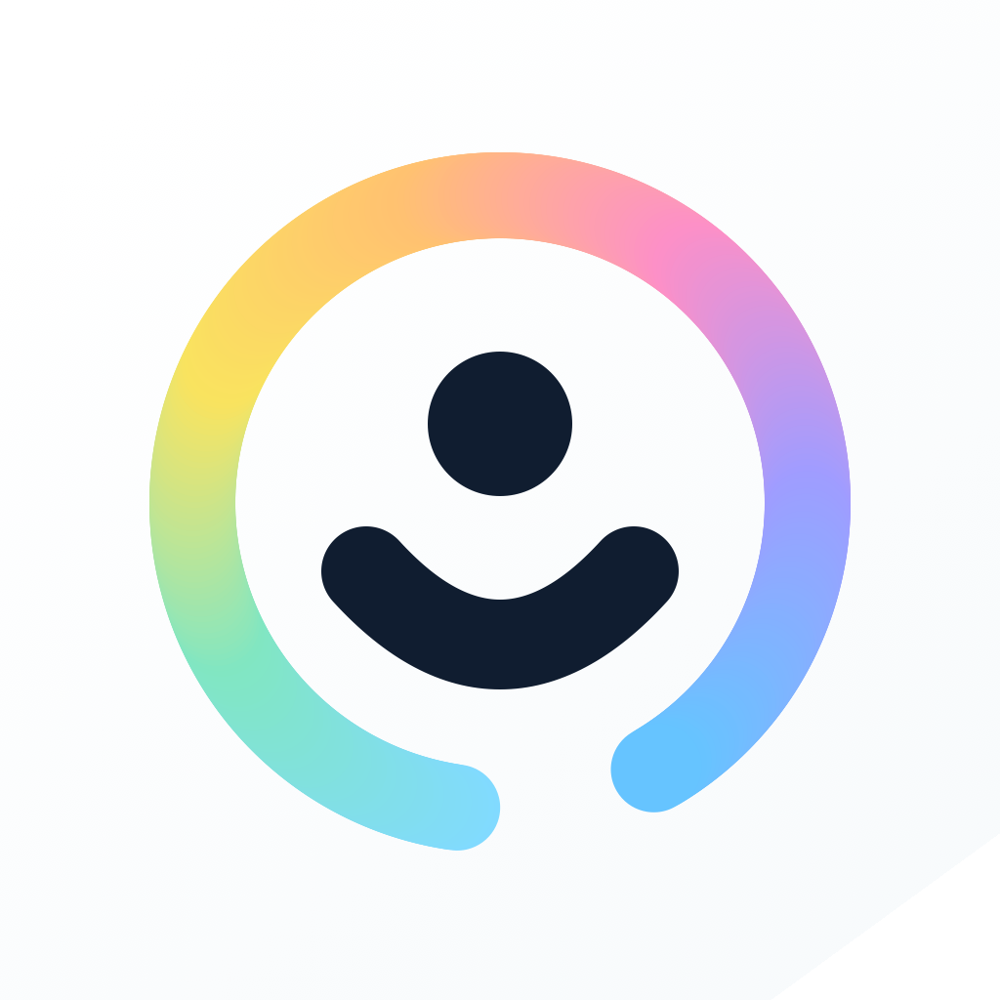

<p align="center">
  
</p>

<h1 align="center">Ownlight</h1>

<p align="center">
  <strong>A private timeline with no audience.</strong><br>
  Capture text, photos, audio, video, documents, and everyday check-ins without turning your life into a social feed.
</p>

<p align="center">
  <a href="https://apps.apple.com/app/id6778719728"></a>
  <a href="https://github.com/Popcornnnnnnnn/ownlight/releases/latest"></a>
</p>

<p align="center">
  <a href="https://github.com/Popcornnnnnnnn/ownlight/actions/workflows/verify.yml"></a>
  
  
  <a href="LICENSE"></a>
</p>

<p align="center">
  <a href="https://apps.apple.com/app/id6778719728">App Store</a> ·
  <a href="https://private-moments.popcornnn.xyz">Privacy &amp; Support</a> ·
  <a href="https://github.com/Popcornnnnnnnn/ownlight/releases/latest">Source Release</a>
</p>

## Why Ownlight

Ownlight sits between a social timeline and a traditional journal. Posting feels lightweight, but everything is for you: no followers, public comments, engagement counters, ads, or pressure to perform.

| | |
| --- | --- |
| **Local first** | New moments are written to the iPhone's local SQLite archive first. Capture, browse, and search still work without a network connection. |
| **Private by design** | Ownlight has no developer-hosted account system or social graph. Optional iCloud sync uses the user's private CloudKit database. |
| **Rich moments** | Record text, photos, audio, video, PDFs, comments, favorites, pins, smart tags, check-ins, and Share Sheet imports. |
| **Reflection, not gamification** | Calendar review, weekly review, memories, search, topic areas, and Markdown help you revisit what mattered. |
| **Bring your own AI** | AI is optional and user-configured. Provider API keys stay in the iPhone Keychain and are excluded from iCloud sync and exports. |
| **Open source** | The public source is MIT licensed. GitHub releases are source-only; signed App Store builds are distributed by Apple. |

## Screenshots

<table>
  <tr>
    <td align="center"><strong>Private timeline</strong><br><br><sub>Capture everyday moments without an audience.</sub></td>
    <td align="center"><strong>Optional AI summaries</strong><br><br><sub>Turn long voice notes into structured reflections.</sub></td>
    <td align="center"><strong>Markdown details</strong><br><br><sub>Keep longer thoughts readable and expressive.</sub></td>
  </tr>
  <tr>
    <td align="center"><strong>Calendar review</strong><br><br><sub>Look back by day, week, and month.</sub></td>
    <td align="center"><strong>Topic areas</strong><br><br><sub>Browse AI-assisted topics without a tag wall.</sub></td>
    <td align="center"><strong>Private iCloud sync</strong><br><br><sub>Keep your own Apple devices in sync when enabled.</sub></td>
  </tr>
</table>

The screenshots use deterministic demo data and contain no private user content.

## Get Ownlight

### App Store

[Download Ownlight on the App Store](https://apps.apple.com/app/id6778719728). The store build is free and contains no ads, subscription, or in-app purchase.

### Build from source

Requirements:

- macOS with Xcode 16 or later.
- iOS 17 or later.
- Node.js 22 or later.
- [XcodeGen](https://github.com/yonaskolb/XcodeGen).
- Your own Apple Developer signing identity for device builds, App Groups, and CloudKit.

```bash
git clone https://github.com/Popcornnnnnnnn/ownlight.git
cd ownlight
npm install
npm run verify:ios:low-impact
```

For machine-specific signing, device, bundle identifier, App Group, and CloudKit overrides:

```bash
cp .env.local.example .env.local
```

Install and launch on a paired iPhone:

```bash
npm run ios:device
```

No pre-signed IPA is published. GitHub releases contain source code only so each developer keeps control of their own signing and CloudKit identity.

## Privacy Model

- **On-device by default:** moments, comments, tags, drafts, media, and generated artifacts live in the app's local archive first.
- **Optional iCloud:** enable `Settings > Data Storage > iCloud > iCloud Sync` to sync through the private CloudKit database of the signed-in Apple Account.
- **Optional external AI:** Ownlight sends the minimum required content only after the user configures a compatible provider and enables the relevant AI workflow.
- **Local credentials:** provider API keys stay in the iPhone Keychain. They are not included in iCloud sync, archive exports, or the legacy server workspace.
- **Portable archive:** `Storage & Export` can create a local archive and restore it into an empty Ownlight library.

See [Security And Privacy](SECURITY.md) for the public security boundary and responsible disclosure path.

## Repository Map

| Path | Purpose |
| --- | --- |
| `ios/PrivateMoments` | The SwiftUI iPhone/iPad app distributed as Ownlight. |
| `ios/PrivateMoments/CloudKit` | Optional private CloudKit cross-device sync. |
| `ios/ShareExtension` | Share Sheet capture into the main app composer. |
| `docs/` | Product, architecture, operations, privacy, and release documentation. |
| `site/` | Static Privacy Policy and Support pages. |
| `server/`, `admin/` | Legacy compatibility and maintenance workspaces; not required for normal Ownlight use. |

## Development

Low-impact iOS verification avoids launching Simulator and limits Xcode build parallelism:

```bash
npm run verify:ios:low-impact
```

Run Simulator only for visual UI review or screenshot work:

```bash
npm run ios:simulator:demo
npm run ios:simulator:cleanup
```

The demo fixture is opt-in and only runs with `--private-moments-demo-data`. It seeds deterministic local moments, tags, comments, AI-summary metadata, media placeholders, and check-ins. The normal app path never seeds demo data.

<details>
<summary><strong>Legacy server and Admin workspace</strong></summary>

The repository retains `server/` and `admin/` for historical compatibility, API reference, archive tooling, and maintenance experiments. They are not part of the ordinary iPhone-first product runtime and are not required for iCloud sync.

```bash
cp server/.env.example server/.env
npm run server:prisma:generate
npm run server:prisma:deploy
npm run admin:build
npm run server:build
npm run server:dev
```

The legacy server defaults to `http://127.0.0.1:3210`; after the Admin build, the maintenance UI is available at `http://127.0.0.1:3210/admin/`. See the [Operator Runbook](docs/OPERATOR-RUNBOOK.md) for archive, restic, launchd, and recovery details.

</details>

## Documentation

- [Product Requirements](docs/PRD.md)
- [Technical Design](docs/TECH-DESIGN.md)
- [Design Principles](docs/DESIGN-PRINCIPLES.md)
- [Operator Runbook](docs/OPERATOR-RUNBOOK.md)
- [Integration Guide](docs/INTEGRATION-GUIDE.md)
- [Workflow](docs/WORKFLOW.md)
- [Release Checklist](docs/RELEASE-CHECKLIST.md)
- [Open Source Readiness](docs/OPEN-SOURCE-READINESS.md)
- [Changelog](CHANGELOG.md)

## Contributing And Releases

Issues and focused pull requests are welcome; start with [CONTRIBUTING.md](CONTRIBUTING.md). Before publishing a source tag or App Store build, run:

```bash
npm run doctor:release
npm run doctor:app-store
npm run verify:ios:low-impact
git diff --check
```

Ownlight is available under the [MIT License](LICENSE).
